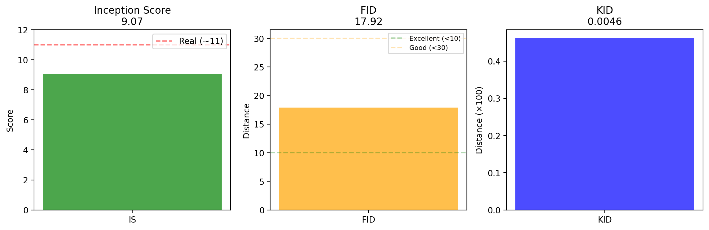
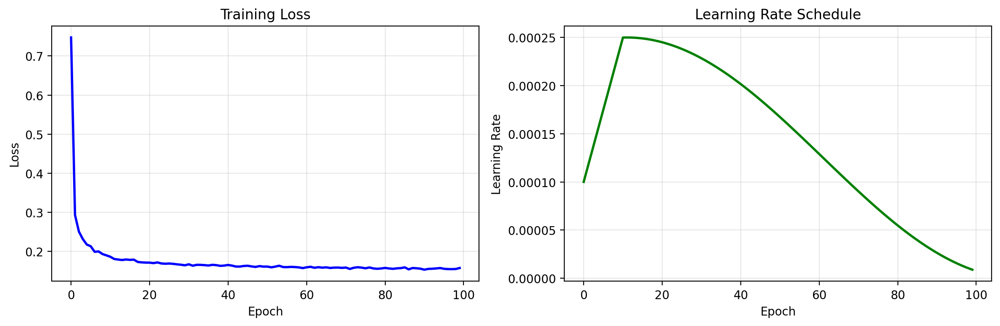
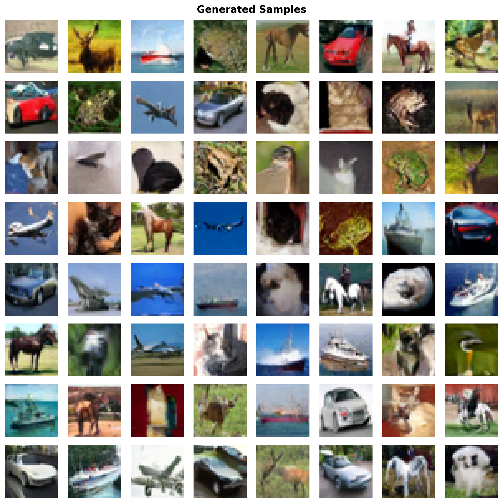

# DenoisingDiffusionProbabilityModel - CIFAR-10 图像生成

基于 PyTorch 实现的去噪扩散概率模型 (DDPM)，用于 CIFAR-10 彩色图像生成任务。

## ✨ 特性

- ✅ **无条件生成**：从随机噪声生成 CIFAR-10 图像
- ✅ **条件生成**：使用 Classifier-Free Guidance 按类别生成图像
- ✅ **完整评估**：支持 IS、FID、KID 等评估指标，一个文件搞定
- ✅ **简洁易用**：代码结构清晰，提供一键评估脚本

我服务器不同批次跑的评估结果都放在 `Outputs/Evalutation` 里了，如果电脑跑不动直接用里面的评估结果图。

## 📊 评估结果

### 数据结果

```
评估结果:
============================================================
inception_score_mean          : 9.0742
inception_score_std           : 0.2055
frechet_inception_distance    : 17.9150
kernel_inception_distance_mean: 0.0046
kernel_inception_distance_std : 0.0006
============================================================

指标说明:
  IS  (Inception Score)       : 越高越好 (真实数据约11-12)
  FID (Frechet Inception Dist): 越低越好 (<10优秀, <30良好)
  KID (Kernel Inception Dist) : 越低越好 (接近0)
============================================================
```

### 指标可视化



### loss 曲线



### 生成样例



## 🚀 如何使用

### 1. 环境配置

#### 方式一：使用 uv (推荐)
```bash
uv add torch torchvision tqdm numpy torch-fidelity
```

#### 方式二：使用 Conda
```bash
conda create -n ddpm python=3.12
conda activate ddpm
conda install pytorch torchvision pytorch-cuda=12.8 -c pytorch -c nvidia
pip install tqdm numpy torch-fidelity
```

### 2. 训练模型

```bash
# 条件生成模型（推荐）
python MainCondition.py

# 或无条件生成模型
python Main.py
```

### 3. 评估模型

使用 `EvaluateModel.py` 一键完成生成、计算指标和保存报告。

```bash
# 完整评估：生成10000张图片，平衡各类别，计算IS/FID/KID
python EvaluateModel.py --mode conditional --balanced
```

## 🔧 常用命令

### 仅生成图片
```bash
python EvaluateModel.py --only_generate --balanced
```

### 仅计算指标
```bash
# 指定生成的图片目录进行计算
python EvaluateModel.py --only_metrics Generated_conditional_w1.8
```

### 对比不同 Guidance 权重
```bash
python EvaluateModel.py --w 1.8 --num_images 5000
python EvaluateModel.py --w 3.0 --num_images 5000
```

## 🎯 EvaluateModel.py 参数说明

| 参数 | 说明 | 默认值 |
|------|------|--------|
| `--mode` | 模式：conditional/unconditional | conditional |
| `--checkpoint` | 模型权重路径 | 自动选择最新 |
| `--num_images` | 生成图片数量 | 10000 |
| `--batch_size` | 批量大小（显存大就调大点） | 100 |
| `--w` | Guidance权重 (条件模型) | 1.8 |
| `--balanced` | 平衡生成各类别 | False |

## 📁 核心文件结构

```
├── MainCondition.py            # 条件模型训练（推荐）
├── Main.py                     # 无条件模型训练
├── EvaluateModel.py            # 评估工具（包含所有评估功能）
├── Diffusion/                  # 无条件扩散模型实现代码
├── DiffusionFreeGuidence/      # 条件扩散模型实现代码
├── Checkpoints/                # 无条件扩散模型权重保存目录
├── CheckpointsCondition/       # 条件扩散模型权重保存目录
└── Outputs/                    # 生成结果保存目录
```

## 📚 参考文献

- **DDPM**: Denoising Diffusion Probabilistic Models (NeurIPS 2020)
- **Classifier-Free Guidance**: Classifier-Free Diffusion Guidance (NeurIPS 2021)
